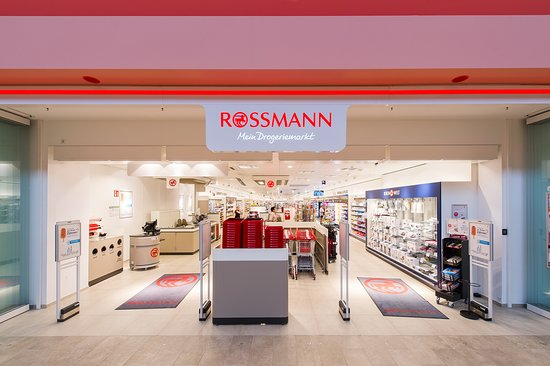
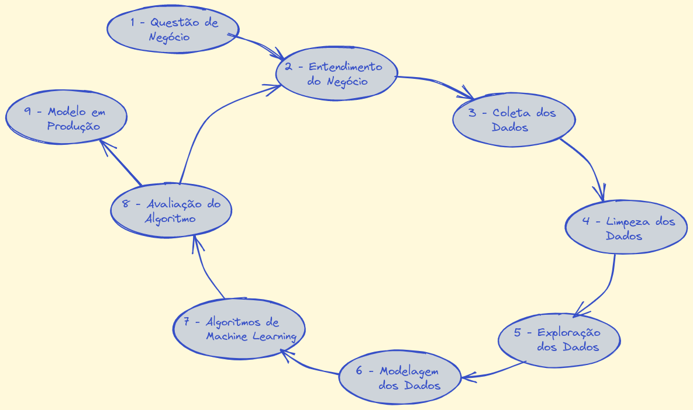
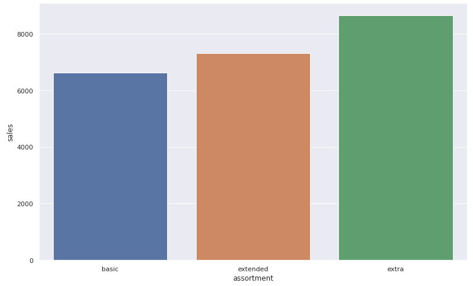
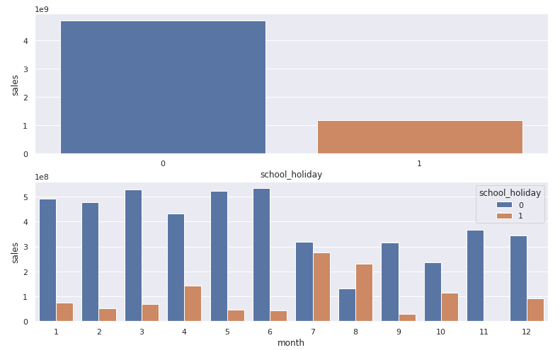
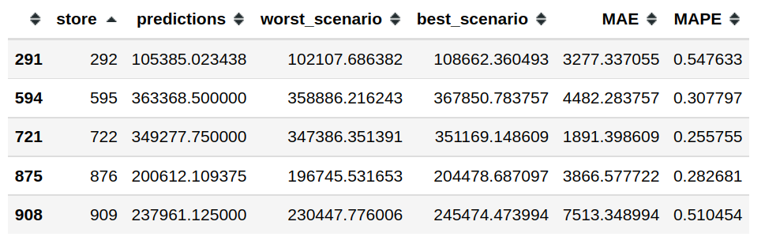
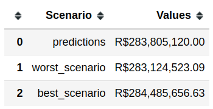

# Predição de Vendas da Rede de Farmácias Rossmann 

 

# 1. O que é a Rossmann

Como o inventor da drogaria na Alemanha, Dirk Rossmann abriu o primeiro "mercado de produtos de drogaria" em Hanover em 1972. Até hoje, a Dirk Rossmann é uma empresa familiar gerida pelo proprietário, ativa internacionalmente e é de propriedade majoritária da família Rossmann. Além disso, o AS Watson Group global tem uma participação de 40% na empresa. A empresa está sediada em Burgwedel, perto de Hanover.

Com 56.500 funcionários na Europa e um total de 4.361 filiais, incluindo 2.231 na Alemanha, o grupo de empresas ROSSMANN é uma das maiores redes de drogarias da Europa. Em 2021, o Grupo ROSSMANN alcançou vendas de 11,1 bilhões de euros na Alemanha, Polônia, Hungria, República Tcheca, Albânia, Kosovo, Espanha e Turquia.

# 2. O Problema de Negócio

O CFO (Chief Financial Officer) da Rossmann pretende fazer uma reforma em todas as unidades da rede, para isso, ele precisa ter uma previsão real de quanto cada loja faturará nas próximas 6 semanas, para então, poder fazer o planejamento da reforma.
O problema apresentado pelo time de negócio é a dificuldade em prever o faturamento de cada loja para as próximas 6 semanas. Neste caso, foi solicitado um projeto com a previsão de vendas de todas as unidades.

 

# 3. Estratégia de Solução

Como estratégia, adotei a prática do método CRISP-DM. Este método é voltado para a resolução rápida pro problema, onde no primeiro ciclo já é possível gerar valor para o time de negócio.

Abaixo você poderá ver como este método funciona:

 

 

# 4. Coleta de Dados

Para solucionar o problema acima a empresa disponibilizou o histórico de vendas de 1.115 lojas no [Kaggle](https://www.kaggle.com/c/rossmann-store-sales). 
Os dados contém as seguintes colunas:

| Atributos | Descrição |
| ------ | ------- |
| Id | Identificador da transação |
| Store | Identificador único para cada loja |
| Sales | Volume de vendas no dia (Variável target) |
| Customers | Número de clientes no dia |
| Open | Indica se a loja está aberta ou fechada |
| StateHoliday | Indica feriado estadual, algumas lojas fecham nos feriados |
| SchoolHoliday | Indica feriado escolar |
| StoreType | Tipo da loja |
| Assortment | Indica o nível de variedade de produtos da loja |
| CompetitionDistance | Distância em metros do concorrente mais próximo |
| CompetitionOpenSince | Mês e ano que abriu o concorrente mais próximo |
| Promo | Indica se está ocorrendo alguma promoção na loja |
| Promo2 | Indica se o prazo final da promoção foi extendido |
| Promo2Since | Indica mês e ano que a loja iniciou a Promo2 |
| PromoInterval | Indica os intervalos consecutivos em que a Promo2 é iniciada |

 

# 5. Limpeza dos Dados

Seguindo a metodologia do CRIP-DM, a etapa a seguir é a limpeza dos dados. Nesta etapa foi realizado o seguinte:

- **_Tratamento dos valores nulos_**: Foram substituidos os valores nulos, desse modo, não perdemos linhas de dados.
- **_Feature Engeneering_**: Foi criado algumas features para posterior análise na sessão de hipóteses.
- **_Filtragem dos dados_**: Foram filtradas apenas as linhas e colunas relevantes para o modelo.

 

# 6. Análise Exploratória dos Dados

O Objetivo desta etapa foi análisar os dados para gerar Insights. Para isso, foram utilizados algumas hipóteses criada pelo time de negócio.
Abaixo você poderá observar algumas dessas hipóteses validada por gráficos para um melhor entendimento.

**H1**. Lojas com maior sortimentos deveriam vender mais.

- **VERDADEIRA**. Lojas com maior diversidade de produtos vendem mais.

 

**H11**. Lojas deveriam vender menos durante os feriados escolares.

- **VERDADEIRA**. Lojas vendem menos durante os feriados escolares, exceto os meses de Julho e Agosto.

 

# 7. Modelagem dos Dados

Nesta etapa, foi realizado o treinamento do algorítimo de Machine Learning, para isso, foram testados 5 algorítmos de Machine learning:

- Average model
- Linear regression
- Lasso
- Random Forest
- XGBoost

Esta etapa foi dividido em duas partes. Na primeira, foi feito uma avaliação simples de cada modelo (Single Perfromance). E na segunda parte, foi aplicado o método de Cross Validation.

Single Performance:

| Model Name | MAE | MAPE | RMSE |
|  --- | --- | --- | --- |
| XGBoost Regressor | 6683.70 | 0.94 | 7330.98 |
| Random Forest | 679.08 | 0.10 | 1010.10 |
| Average Model | 1354.80 | 0.20 | 1835.14 |
| Linear Regression | 1867.09 | 0.29 | 2671.05 |
| Linear Regression Regularized | 1891.70 | 0.29 | 2744.45 |
 

Cross Validation Performance:

| Model Name | MAE | MAPE | RMSE |
|  --- | --- | --- | --- |
| Random Forest | 837.7 +/- 219.24 | 0.12 +/- 0.02 | 1256.59 +/- 320.28 |
| XGBoost Regressor | 7049.23 +/- 588.53 | 0.95 +/- 0.0 | 7715.24 +/- 689.33 |
| Linear Regresion | 2081.73 +/- 295.63 | 0.3 +/- 0.02 | 2952.52 +/- 468.37 |
| Lasso | 2116.38 +/- 341.5 | 0.29 +/- 0.01 | 3057.75 +/- 504.26 |

Os algoritmos foram avaliados utiliando a técnica de cross validation, que pode ser observado na imagem abaixo:

 

Dentre os modelos testados, o XGBoost não teve a melhor performance, porém, a escolha do modelo XGBoost foi baseado, entre outros fatores menores, no tempo de processamento do algoritmo, que é muito menor que o Random Forest, significando redução de custos de processamento e cloud.

# 8. Avaliação do Algoritmo

Nesta etapa, conseguimos observar os primeiros resultados conforme as imagens abaixo:

 

 

# 9. Deploy do modelo em produção

Após execução bem sucedida do modelo o objetivo e publica-lo em um ambiente de nuvem para que outras pessoas ou serviços possam usar os resultados para melhorar a decisão de negócios. A escolha foi criar uma API usando a plataforma de nuvem Heroku e os passos foram:

- Salvar o modelo já treinado e com todos os ajustes finos de hiper parâmetros para não ter de realizar no ambiente de produção;
- Criar uma classe com os métodos de limpeza, transformação, encoding e predição para encapsular o funcionamento do aplicativo;
- Criar uma aplicação em Flask para ser o controler da arquitetura que vai receber as requisições, encaminhar para o modelo processar e devolver o resultado via response;
- Criar a estrutura das pastas, criar os arquivos de configurações necessárias e publicar na ferramenta de cloud Heroku.

## 9.1 Resultado final com Bot no Telegram

> Esta API é responsável pela comunicação com o usuário final.
Uma vez que o usuário realizar uma consulta informando o ID da loja a qual deseja a previsão, o arquivo **_rossmann-bot.py_** carrega os dados de atributos da loja que agora estão em produção (usuário não precisa mais informa-los), realiza alguns tratamentos, o transforma em json, e então realiza uma consulta na API apresentada anteriormente, a handler.py. 

> Essa API, como informado, retorna um json com o dados de entrada acrescido do valor da previsão de cada uma das lojas. Por fim, o **_rossmann-bot.py_** transforma esse json, soma as predições e informa o usuário por meio de uma mensagem, o valor total das previsões de venda para as próximas 6 semanas

## 9.2 Bot Telegram

Ao final de todo o processo temos o modelo em produção em pleno funcionamento.

 

 

# 10. Próximos passos

Começar um segundo ciclo do CRISP para analisar o problema sob o ponto de vista da experiência adquirida durante o pipeline de desenvolvimento procurando novas abordagens. Possíveis pontos à serem revisitados:

- Nova abordagem no tratamento de dados faltantes;
- Fazer Rescaling e Encoding utilizando métodos diferentes;
- Criar novas hipóteses;
- Criar/derivar novas features;
- Usar métodos mais robustos para seleção dos melhores Hiper parâmetros;
- Testar diferentes algoritmos de Machine Learning.

# 11. Contato

Este projeto foi inteiramente desenvolvido por mim com base nos conceitos ensinados no curso DS em Produção da Comunidade DS. Fique a vontade para entrar em contato comigo através do meu LinkedIN.
Conecte-se comigo no meu [Linkedin](https://www.linkedin.com/in/thomas-karsten/).

